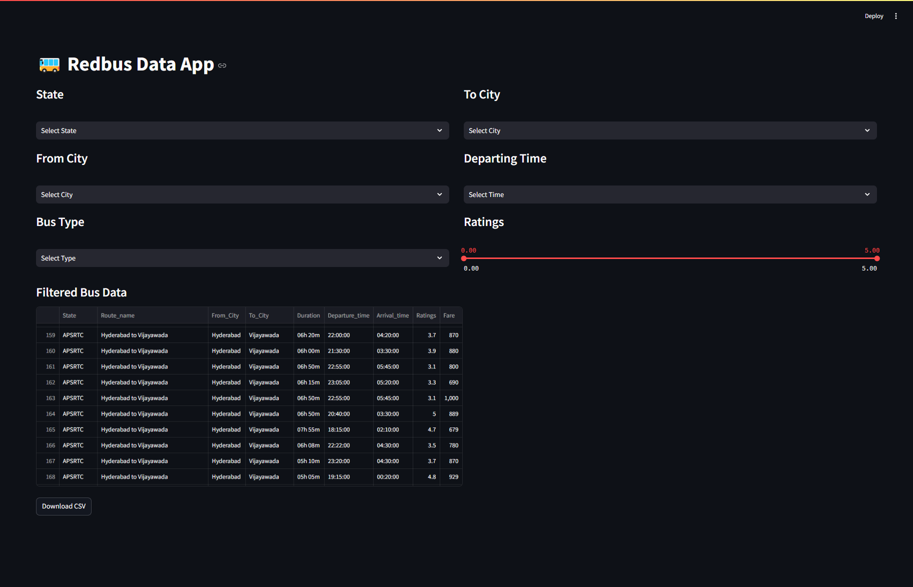

# RedBus Website Scraping Project

This project involves scraping data from the Redbus website using Selenium, storing the data in a MySQL database, and creating a Streamlit app for data filtration.

## Project Structure

- **Selenium**: Used for web scraping to extract data from the Redbus website.
- **MySQL**: Database to store the scraped data.
- **Streamlit**: Web application framework to create an interactive data filtration interface.

## Requirements

- Python 3.x
- Selenium
- MySQL
- Streamlit
- Pandas
- Numpy

## Setup Instructions

1. **Clone the repository**:
    ```bash
    git clone https://github.com/yasararafath-s/Dataspark.git
    cd 06_RedBus
    ```

2. **Install dependencies**:
    ```bash
    pip install -r requirements.txt
    ```

3. **Configure MySQL**:
    - Create a database and update the connection details in the script.

4. **Run the scraper**:
    ```bash
    # Open and run the notebook
    jupyter notebook redbus_scraping_sql.ipynb
    ```

5. **Start the Streamlit app**:
    ```bash
    streamlit run redbus_data_app.py
    ```

## Usage

- Run the scraper to collect data from the Redbus website.
- Use the Streamlit app to filter and visualize the data.

## Files

| File | Description |
|------|-------------|
| `redbus_scraping_sql.ipynb` | Selenium scraping + MySQL data ingestion notebook |
| `redbus_data_app.py` | Streamlit app for filtering and viewing bus data |
| `Appimage.png` | Screenshot of the Streamlit app |
| `App_demo_redbus.webm` | Video demo of the app |

## Screenshot


